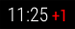
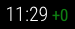

# MMM-PublicTransportHafas

MMM-PublicTransportHafas is a module for the [MagicMirror](https://github.com/MichMich/MagicMirror) project by [Michael Teeuw](https://github.com/MichMich).

[](https://codeclimate.com/github/raywo/MMM-PublicTransportHafas/maintainability) 
[](https://codeclimate.com/github/raywo/MMM-PublicTransportHafas/test_coverage)
[](https://snyk.io/test/github/raywo/mmm-publictransporthafas?targetFile=package.json)
[](https://greenkeeper.io/)
[](https://david-dm.org/raywo/MMM-PublicTransportHafas)
[](https://gitter.im/raywo)


It shows live public transport information in Germany for all stations known to the Deutsche Bahn system. Most public transportation providers in Germany providing information for that system so the coverage should be quite good. The data is provided by the most beautiful [hafas-client](https://github.com/derhuerst/hafas-client) by [Jannis Redmann (derhuerst)](https://github.com/derhuerst). Even in other european contries this module should work as HAFAS is widely used throughout Europe.

This module is intended to replace [MMM-PublicTransportLeipzig](https://github.com/raywo/MMM-PublicTransportLeipzig) since it uses the very unrealiable data provided by the LVB (Leipziger Verkehrsbetriebe). Thus the colors for the tram lines match the pattern used in Leipzig. But you can very easy adapt that to your needs. See [Providing a custom css file](#providing-a-custom-css-file).


## How it works

After you installed MMM-PublicTransportHafas you just configure it to your needs and that’s it. The only config you really need to set is the stationID property. This determines the station you want to display. Everything else is covered by defaults but can be configured by you anyway. For instance you can enter a time you need to get to the station (`timeToStation` in config). The module then only shows departures you can reach respecting the set time.

For more information see the [Configuration](#configuration) section.


## Screenshots

|<br>*Leipzig, Goerdelerring (all directions)*|<br>*Leipzig, Goerdelerring (heading to main station)*|
|---|---|
|<br>*Hauptbahnhof, Leipzig (displaying only trams and two unreachable departures)*|<br>*Hauptbahnhof, Leipzig (displaying only regional and national trains)*|


## Preconditions

* MagicMirror<sup>2</sup> instance
* Node.js version >= 7
* npm


## Installing

Just clone the module into your MagicMirror modules folder and execute `npm install` in the module’s directory:

```bash
git clone https://github.com/raywo/MMM-PublicTransportHafas.git
cd MMM-PublicTransportHafas
npm install
```


## Updating

Go to the module’s folder inside MagicMirror modules folder and pull the latest version from GitHub and install:

```bash
git pull
npm install
```


## How to get the `stationID`

For your convenience a script to query the hafas system for a `stationID` is included. The script is located in the `convenience` folder inside the module’s folder. Run the script and enter the station name. It is useful to enter a city name too since the system knows a lot of stations even outside Germany.

Running the script:

change to `MagicMirror/modules/MMM-PublicTransportHafas` then start the script by typing

```bash
node ./convenience/query_station.js 
```

The following example shows a query for "Leipzig, Wilhelm-Leuschner-Platz". This station is included two times in the result. You have to experiment which ID gives the best results.

```
Geben Sie eine Adresse oder einen Stationsnamen ein: Leipzig, Wilhelm-Leuschner-Platz

Gefundene Haltestellen für "Leipzig, Wilhelm-Leuschner-Platz":

> Haltestelle: "Leipzig Wilhelm-Leuschner-Platz"
  ID: 008012202
  Verkehrsmittel: S-Bahn, Bus, Tram

> Haltestelle: "Wilhelm-Leuschner-Platz, Leipzig"
  ID: 000955252
  Verkehrsmittel: Bus, Tram

> Haltestelle: "Wilhelm-Leuschner-Platz, Weiterstadt"
  ID: 000115849
  Verkehrsmittel: Bus

> Haltestelle: "Wilhelm-Liebknecht-Platz, Leipzig"
  ID: 000956558
  Verkehrsmittel: Bus, Tram
``` 


## Configuration

The module is quite configurable. These are the possible options:

| Option | Description |
|--------|-------------|
| `stationID`                       | <p>The ID you want to display departures for.</p><p>**Type:** `string` **REQUIRED**<br>**Example:** `"008012202"`<br>**Default Value:** none</p><p>**Note:** How to get the ID is described [here](#how-to-get-the-stationid).</p>|
| `stationName`                     | <p>The name of the station as it should appear on the display.</p><p>**Type:** `string` **OPTIONAL**<br>**Example:** `"Wilhelm-Leuschner-Platz"`<br>**Default Value:** none</p><p>**Note:** If you leave this setting, `headerPrefix` and `headerAppendix` blank the module will show an empty header.</p>|
| `headerPrefix`                    | <p>The text to be prepended to the `stationName`.</p><p>**Type:** `string` **OPTIONAL** <br>**Example:** `"von"` (Will result in “von Wilhelm-Leuschner-Platz” being displayed.) <br>**Default Value:** `""`</p><p>**Note:** A blank between `headerPrefix` and `stationName` is automatically inserted.</p>|
| `headerAppendix`                  | <p>The text to be prepended to the `stationName`.</p><p>**Type:** `string` **OPTIONAL** <br>**Example:** `"(Richtung HBF)"`<br>**Default Value:** `""`</p><p>**Note:** A blank between `headerAppendix` and `stationName` is automatically inserted.</p>|
| `updatesEvery`                    | <p>The time in seconds when the displayed departures should be updated.</p><p>**Type:** `integer` **OPTIONAL** <br>**Example:** `60` (The departures will be refreshed every minute.)<br>**Default Value:** `120`</p><p>**Note:** The minimal refresh time is 30 seconds.</p>|
| `direction`                       | <p>An ID of a station. It is used to display only those departures heading to this station. </p><p>**Type:** `string` **OPTIONAL**<br>**Example:** `"000954609"`<br>**Default Value:** `""`</p><p>**Note:** It is not neccessary to find the ID of the end station. Just use the next station which is on the route you are after.<br>It is not possible to list multiple IDs. If you want to display different directions for one station use multiple instances of this module.</p>|
| `ignoredLines`                    | <p>An array of strings describing the lines you want to exclude from the displayed departures.</p><p>**Type:** `array` **OPTIONAL** <br>**Example:** `[ "STR 11", "STR 10" ]` (Displays all lines except tram 10 and 11.)<br>**Default Value:** `[]`</p><p>**Note:** You need to provide the line names exactly as they are otherwise displayed. This setting is case sensitive. Blanks need to be exactly as they are display. If a line is usually displayes as `BUS  89` (two blanks) you need to type exactly that into the array. </p>|
| `excludedTransportationTypes`     | <p>An array of strings describing the transportation types you want to exclude from the displayed departures.</p><p>**Type:** `array` **OPTIONAL** <br>**Example:** `[ "suburban", "bus" ]`<br>**Default Value:** `[]`<br>**Possible Values:** <table><tr><th>Type</th><th>Use in Germany</th></tr><tr><td>`"bus"`</td><td>bus</td></tr><tr><td>`"ferry"`</td><td>F&auml;hre</td></tr><tr><td>`"express"`</td><td>?</td></tr><tr><td>`"national"`</td><td>IC trains</td></tr><tr><td>`"nationalExp"`</td><td>ICE trains</td></tr><tr><td>`"regional"`</td><td>RB or RE</td></tr><tr><td>`"suburban"`</td><td>S-Bahn</td></tr><tr><td>`"subway"`</td><td>U-Bahn</td></tr><tr><td>`"tram"`</td><td>Tram</td></tr><tr><td>`"taxi"`</td><td>Taxi</td></tr></table></p>|
| `timeToStation`                   | <p>An integer indicating how long it takes you to get to the station.</p><p>**Type:** `integer` **OPTIONAL**<br>**Example:** `5`<br>**Default Value:** `10` </p><p>**Note:** The time is given in minutes.</p>|
| `timeInFuture`                    | <p>An integer indicating how far in the future a departure can be to be still included in the shown departures.</p><p>**Type:** `integer` **OPTIONAL** <br>**Example:** `60` (Show departures for the next hour.)<br>**Default Value:** `10`</p><p>**Note:** The time is given in minutes.<br>Use this setting on stations where there is a big time gap between departures. This way you will see more than one or two departures.</p>|
| `marqueeLongDirections`           | <p>A boolean value indicating whether you want scrolling long destination name or not.</p><p>**Type:** `boolean` **OPTIONAL** <br>**Example:** `false` <br>**Default Value:** `true`</p><p>**Note:** If set to `true` destination names longer than 24 characters will scroll through the display. If set to `false` names will be truncated at 24 characters.</p>|
| `showColoredLineSymbols`          | <p>A boolean value indicating whether the line symbols should be colored or black and white.</p><p>**Type:** `boolean` **OPTIONAL** <br>**Example:** `false` <br>**Default Value:** `true`</p><p>**Note:** If set to `true` it is possible to decorate the line labels with the colors which are used in your town. This module comes with decorations for Leipzig. To provide your own colors see [Providing a custom css file](#providing-a-custom-css-file).</p>|
| `useColorForRealtimeInfo`         | <p>A boolean value indicating whether delays should be displayed in color.</p><p>**Type:** `boolean` **OPTIONAL** <br>**Example:** `false` <br>**Default Value:** `true` </p><p>**Note:** If set to `true` a delay will be displayed in red. Values `<= 0` (transport arrives in time or early) will be displayed in green. If you want to customize that see [Providing a custom css file](#customizing-the-color-for-delays). </p>|
| `showAbsoluteTime` | <p>A boolean indicating whether the departure time should be displayed as an absolute value or not.</p><p>**Type:** `boolean` **OPTIONAL** <br>**Example:** `false`<br>**Default Value:** `true`</p><p>**Note:** If set to `true` the departure time would be displayed as “10:15+0”. If set to `false` the departure time would be displayed in a relative manner like so: `in 5 minutes`. The displayed string is determined by your locale. If your locale is set to `de` the string would be `in 5 Minuten`. </p> |
| `showTableHeaders`                | <p>A boolean indicating whether a table header should be shown or not.</p><p>**Type:** `boolean` **OPTIONAL** <br>**Example:** `false`<br>**Default Value:** `true`</p><p>**Note:** If set to `false` no table headings like “time” or “direction” will be shown. Also no symbols are shown.</p>|
| `showTableHeadersAsSymbols`       | <p>A boolean value indicating whether table headers should be shown as symbols or text.</p><p>**Type:** `boolean` **OPTIONAL** <br>**Example:** `false` <br>**Default Value:** `true` </p><p>**Note:** If set to `true` table headers will use symbols, else text will be shown. This setting is only effective if `showTableHeaders` is set to `true`. The shown text is available in English and German. Feel free to add translations to this project.</p>|
| `maxUnreachableDepartures`        | <p>An integer value denoting how many unreachable departures should be displayed.</p><p>**Type:** `integer` **OPTIONAL** <br>**Example:** `3`<br>**Default Value:** `0`</p><p>**Note:** A departure is unreachable if you can't reach the station in time for the departure with respect to your `timeToStation` setting.<br>Sometimes it is useful to set this option to a value greater than `0` if you are the type of person which walks really fast. Maybe other users of the mirror usually take 10 minutes to the station but you take only 5. So you’ll see also departures the other users couldn’t reach.</p>|
| `maxReachableDepartures`          | <p>An integer value denoting how many reachable departures should be displayed.</p><p>**Type:** `integer` **OPTIONAL** <br>**Example:** `5` <br>**Default Value:** `7` </p><p>**Note:** A departure is reachable if you can make it to the station in time for the departure with respect to your `timeToStation` setting.</p>|
| `fadeUnreachableDepartures`       | <p>A boolean value indicating whether unreachable departures should be dimmed.</p><p>**Type:** `boolean` **OPTIONAL** <br>**Example:** `false` <br>**Default Value:** `true` </p>|
| `fadeReachableDepartures`         | <p>A boolean value indicating whether reachable departures should be faded out.</p><p>**Type:** `boolean` **OPTIONAL** <br>**Example:** `false` <br>**Default Value:** `true` </p><p>**Note:** If set to `true` departures after `fadePointForReachableDepartures` will be gradually faded out so that the last departure is barely visible. </p>|
| `fadePointForReachableDepartures` | <p>A floating point value indicating where to start the fading of departure rows.</p><p>**Type:** `float` **OPTIONAL** <br>**Example:** `0.5` (Start fading after half of the rows.)<br>**Default Value:** `0.25` </p><p>**Note:** This value is actually a percentage. The default value of `0.25` denotes that after a quarter of the visible rows set by `maxReachableDepartures` the fading should start. This setting is only effective if `fadeReachableDepartures` is set to `true`. </p>|
| `customLineStyles`                | <p>A string value describing the name of a custom css file.</p><p>**Type:** `string` **OPTIONAL** <br>**Example:** `"dresden"`<br>**Default Value:** `"leipzig"`</p><p>**Note:** If the setting `showColoredLineSymbols` is `true` the module will try to use colored labels for the line name. Per default it uses the colors used in Leipzig. You can provide your own settings. See [Providing a custom css file](#providing-a-custom-css-file). </p>|
| `showOnlyLineNumbers`             | <p>A boolean value denoting whether the line name should be displayed as a number only or the full name should be used. </p><p>**Type:** `boolean` **OPTIONAL** <br>**Example:** `true` <br>**Default Value:** `false` </p><p>**Note:** If set to `true` the module will try to separate line numbers from the line name and display only these. If the line name is “STR 11” only “11” will be displayed. This only works if there are blanks present in the line name. This setting is only tested with departures in Leipzig. If you encounter problems [let me know](https://github.com/raywo/MMM-PublicTransportHafas/issues).</p>|


Here is an example for an entry in `config.js`

```javascript
{
  module: "MMM-PublicTransportHafas",
  position: "bottom_right",
  
  config: {
    stationID: "008012202",                   // Replace with your stationID!
    stationName: "Wilhelm-Leuschner-Platz",   // Replace with your station name!
  
    direction: "",                    // Show only departures heading to this station. (A station ID.)
    ignoredLines: [],                 // Which lines should be ignored? (comma-separated list of line names)
    excludedTransportationTypes: [],  // Which transportation types should not be shown on the mirror? (comma-separated list of types) possible values: StN for tram, BuN for bus, s for suburban
    timeToStation: 10,                // How long do you need to walk to the next Station?
    timeInFuture: 10,                 // Show departures for the next *timeInFuture* minutes.

    showColoredLineSymbols: true,     // Want colored line symbols?
    useColorForRealtimeInfo: true,    // Want colored real time information (timeToStation, early)?
    showTableHeadersAsSymbols: true,  // Table Headers as symbols or text?
    maxUnreachableDepartures: 0,      // How many unreachable departures should be shown?
    maxReachableDepartures: 7,        // How many reachable departures should be shown?
    customLineStyles: "leipzig",      // Prefix for the name of the custom css file. ex: Leipzig-lines.css (case sensitive)
    showOnlyLineNumbers: false        // Display only the line number instead of the complete name, i. e. "11" instead of "STR 11"
  }
},
```


## Mulitple instances

It is possible to use multiple instances of this module just by adding another entry of the MMM-PublicTransportHafas module to the `config.js` of your mirror. 

You can even use the same `stationID` in different instances. So you can display in one instance something like “main station heading eastbound” and in another instance “main station heading westbound”.


## Providing a custom css file

### Colored line labels

If you set `showColoredLineSymbols` to `true` the module will try to colorize the line symbols. This is done by appending a css class to the line symbol. This class is named after the line name but blanks are left out and all letters are lower case. So if the line name is “STR 11” the appended css class name is `.str11`.

To provide your own classes create a css file in the `css` directory of the module. It must be named like `<your custom name>-lines.css`, where `<your custom name>` can be any valid file name but should not contain blanks or dots. The part `<your custom name>` is then used in the config file as value for the `customLineStyles` property.

#### Example:

In the example above “leipzig” is used as value for the `customLineStyles` property. Therefore there must be a file named `leipzig-lines.css` inside the `css` folder. If this is not the case the module won’t be started and it will not be visible. The browser’s console will show an error.

Basically you can set whatever you want in the css file but it is recommended to only set the foreground and background color and the width. In some cases it is useful to change the border radius too. See the file `css/leipzig-lines.css` for reference and as a guideline.

#### Example:

In Leipzig the tram lines 2, 8 and 9 use a yellow color. Since the lines share the same settings the css class names are listed with commas so that the settings apply to each listed class.

```css
.str2, .str8, .str9 {
  background-color: #F8C623;  /* yellow background */
  color: black;               /* text color black */
  width: 1em;                 /* the width is equal to the font size (the line symbol will be a square) */
}
```

Some night buses in Leipzig use an orange-ish color. All bus symbols are circles in Leipzig.

```css
.busn1, .busn1e, .busn5, .busn5e, .busn8, .busn8e {
  background-color: #EE9F2E;  /* orange-ish background */
  border-radius: 1em;         /* border radius is the same as the width so a circle will appear */
  color: #164585;             /* blue-ish text color */
  width: 1em;                 /* the width is equal to the font size (the line symbol will be a square, or in this case a circle) */
}
```

### Customizing the color for delays

Alongside the departure time a small figure displays the delay as reported by the transport provider. 

 

Delays are displayed as red. No delay or negative delays (the transport will arrive early) are displayed in green. If you want to customize that include the classes `pthHasDelay` and `pthIsTooEarly` in your custom css file and make the appropriate settings.


## Special Thanks

* [Michael Teeuw](https://github.com/MichMich) for inspiring me and many others to build a MagicMirror module.
* [Jannis Redmann](https://github.com/derhuerst) for creating the most useful [hafas-client](https://github.com/derhuerst/hafas-client) library which provides the data for this module.
* The community of magicmirror.builders for help in the development process and all contributors for finding and fixing errors in this module.


## Contributing

If you find any problems, bugs or have questions, please [open a GitHub issue](https://github.com/raywo/MMM-PublicTransportHafas/issues) in this repository.
