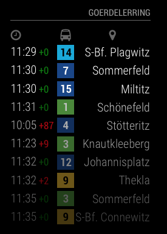
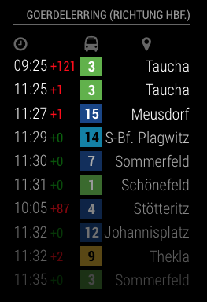
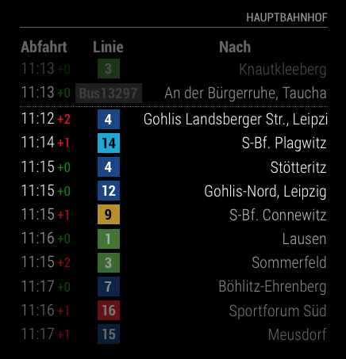
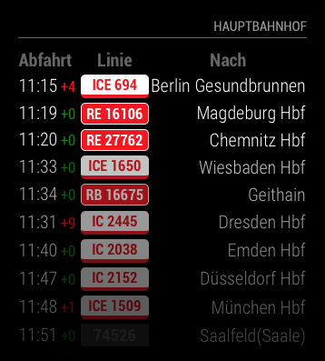

# MMM-PublicTransportHafas

MMM-PublicTransportHafas is a module for the MagicMirror project by Michael Teeuw.

It shows live public transport information for all regions where the public transport provider uses the HAFAS interface. In Germany that is true for most providers. The data is provided by the most beautiful [hafas-client](https://github.com/derhuerst/hafas-client) by [Jannis Redmann (derhuerst)](https://github.com/derhuerst). Even in other european contries this module should work as HAFAS is widely used throughout Europe.

This module is intended to replace [MMM-PublicTransportLeipzig](https://github.com/raywo/MMM-PublicTransportLeipzig) since it uses the very unrealiable data provided by the LVB (Leipziger Verkehrsbetriebe). Thus the colors for the tram lines match the pattern used in Leipzig. But you can very easy adapt that to your needs. See [Providing a custom css file](#providing-a-custom-css-file).

## How it works

After you installed MMM-PublicTransportHafas you just configure it to your needs and that’s it. The only config you really need to set is the stationID property. This determines the station you want to display. Everything else is covered by defaults but can be configured by you anyway. For instance you can enter a time you need to get to the station (`timeToStation` in config). The module then only shows departures you can reach respecting the set time.

For more information see the [Configuration](#configuration) section.

## Screenshots

| *Leipzig, Goerdelerring (all directions)*| *Leipzig, Goerdelerring (heading to main station)*|
|---|---|
| *Hauptbahnhof, Leipzig (displaying only trams and two unreachable departures*| *Hauptbahnhof, Leipzig (displaying only regional and national trains)*|

## Providing a custom css file

## Configuration
